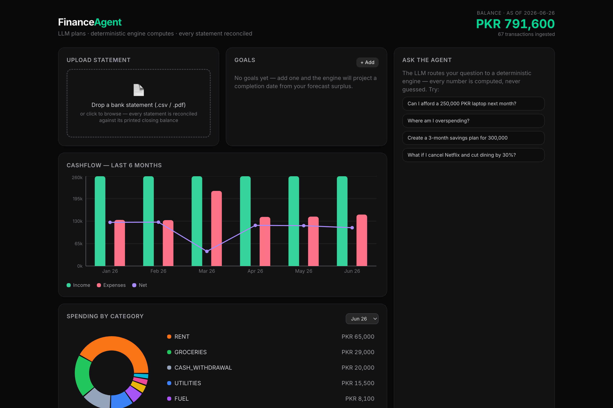

# Personal Finance Agent

A finance assistant that reads your bank statements and answers questions about them. The twist is in the division of labour: a language model decides *what* to do, but it never does the arithmetic. Every rupee figure comes from plain Python with unit tests behind it. The model classifies the question, fills in the arguments for a tool, and writes the final sentence. Nothing more.



## The idea

Most "AI for finance" demos let the model add up your spending. I think that's the wrong place to use one. Models get arithmetic wrong, and when they do you usually can't tell. So the split here is strict:

- **The model** understands the question, picks a tool, and turns the result into prose.
- **The engine** computes every number. Pure functions, no I/O, fully tested.

After the model writes an answer, a check pulls out every number it used and confirms each one actually appears in the engine's output. If it invented a figure, the answer is regenerated, and failing that, replaced with a templated one built straight from the engine result. A made-up number can't reach the user.

The whole app also runs with no API key. The router, planner, and explainer each have rule-based fallbacks, so the demo and the entire test suite work offline. A key makes the language understanding more flexible; it never touches the math.

## What it does

- Reads statements as CSV, text PDF, or scanned PDF (via OCR), plus invoices. Adapters handle two real Pakistani bank layouts (HBL and Meezan) and a generic fallback that infers the columns from the data.
- Reconciles every statement: `opening balance + sum of transactions` has to equal the printed closing balance. If it doesn't, the statement is marked failed and its transactions are kept out of every answer rather than quietly skewing the numbers.
- Skips duplicates on re-upload, even when the same data comes back in a different bank's export format.
- Answers four kinds of question in the chat box:
  - *Affordability* — "Can I afford a 250,000 PKR laptop next month?"
  - *Diagnosis* — "Why did my cash flow drop this month?"
  - *Planning* — "Make a 3-month savings plan for 300,000."
  - *What-if* — "What if I cancel Netflix and cut dining by 30%?"
- Detects recurring payments, including when a subscription quietly gets more expensive, and flags unusual transactions with a reason you can read.
- Handles factual lookups with generated SQL (read-only and guarded) and invoice questions with vector search.

## Why the numbers hold up

This is the part I spent the most time on.

- Money is stored as integer paisa everywhere. Floating point only shows up when formatting a value for the screen.
- The engine is pure functions, covered by golden tests (with hand-computed expected values) and property tests (Hypothesis). A few of the properties: category totals always sum to the expense total; `opening + transactions` always equals `closing`; raising a purchase price can never flip an affordability "no" into a "yes"; a feasible savings schedule always sums to exactly the goal.
- Reconciliation is enforced, not just reported. A failed statement is excluded from answers and shown as a warning on the dashboard.
- The SQL path is locked down in code rather than by asking the model nicely: SELECT only, single statement, table allowlist, an injected `LIMIT`, and a read-only database connection. The test suite throws "delete all rows" style inputs at it and checks they're rejected.
- 105 tests cover the above. `cd backend && pytest` runs them in about a second.

## How it fits together

```
            language model                          deterministic engine (pure)
        ┌────────────────────┐                  ┌──────────────────────────────┐
question│ classify intent    │  tool + JSON args│ cashflow · forecast ·        │
───────▶│ pick a tool        │─────────────────▶│ affordability · savings ·    │──┐
        │ fill arguments     │  (Pydantic-       │ simulate · recurring ·       │  │
        └────────────────────┘   validated)     │ anomalies · reconcile        │  │
                  ▲                              └──────────────────────────────┘  │
                  │ prose, checked so every                                        │
                  └── number traces to the result ◀─────────────────────────────--┘

upload ─▶ parser (csv / pdf / ocr) ─▶ bank adapter ─▶ normalize ─▶ reconcile ─▶ SQLite
                                                                   (flag, never silent)
```

The agent graph is built with LangGraph: router → planner → tool → explainer. The planner only ever emits a tool name and a JSON argument object, which is validated against a Pydantic schema before anything runs.

## Running it locally

Backend (Python 3.11):

```bash
cd backend
python -m venv .venv && source .venv/bin/activate
pip install -e ".[dev]"
cp .env.example .env          # optional: add ANTHROPIC_API_KEY to enable the model path
uvicorn app.main:app --reload # http://localhost:8000
```

Frontend (Node 18+):

```bash
cd frontend
npm install
npm run dev                   # http://localhost:5173
```

Drag `sample_data/hbl_statement_2026_q1.csv` and `..._q2.csv` onto the upload box. The sample data has a few things planted in it: a large jewellery purchase in March (flagged as an anomaly), a duplicated food-delivery charge in April, and a Netflix price rise in May (caught as a recurring price change). Re-upload a file to watch the dedup skip everything.

Optional extras: `pip install -e ".[ocr]"` plus `brew install tesseract poppler` for scanned PDFs; `".[embeddings]"` for sentence-transformers (otherwise a small built-in embedder is used); `".[tables]"` for camelot.

## Live demo / deploy

The app ships as a single container: FastAPI serves the API and the built dashboard from one origin, the sample data seeds itself on first boot, and no API key is required. Run it in one command:

```bash
docker compose up --build      # http://localhost:8000
```

To put it online for free, push to GitHub and deploy on Render with the included blueprint:

[](https://render.com/deploy?repo=https://github.com/musiuuu/personalFinanceAgent)

Render's free tier sleeps after about 15 minutes idle, so the first visit can take ~30–60s to wake. Full steps are in [DEPLOY.md](DEPLOY.md).

## Project layout

```
backend/app/engine/      the deterministic core — no model calls in here
backend/app/ingestion/   parsers, bank adapters, normalization, reconcile gate
backend/app/categorize/  keyword rules → cache → optional model fallback
backend/app/retrieval/   guarded NL→SQL and the vector store
backend/app/agent/       LangGraph graph, tools, the number-tracing check
backend/app/api/         FastAPI endpoints
backend/tests/           golden + property tests, SQL-guard tests, agent eval
frontend/                React, TypeScript, Tailwind, Recharts
sample_data/             synthetic PKR statements that reconcile by construction
```

## Stack

Python 3.11, FastAPI, LangGraph, Anthropic API, SQLModel/SQLite, Pydantic v2, pdfplumber, Tesseract OCR, sentence-transformers. React 18, TypeScript, Vite, Tailwind, Recharts. pytest and Hypothesis for tests. Docker for deployment.

## Scope

One local user, file upload only. No bank APIs, no money movement, not financial advice. Amounts are PKR by convention; nothing is currency-specific except the merchant keyword list.
